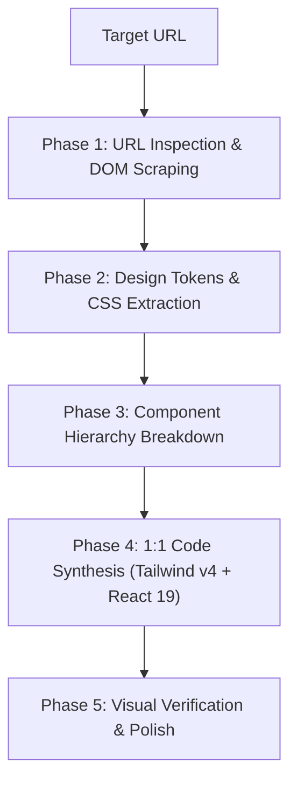

---
name: website-design-cloner
description: "Analyzes and reverse-engineers website designs directly from a target URL, extracting layout structures, design tokens (colors, typography, spacing), component hierarchies, visual assets, and responsive behaviors to enable full 1:1 duplication into modern code (Tailwind CSS v4, React/Next.js, HTML/CSS). / Mempelajari dan merekayasa balik desain situs web langsung dari URL target, mengekstrak struktur layout, design token (warna, tipografi, spacing), hierarki komponen, aset visual, dan perilaku responsif untuk duplikasi 1:1 penuh ke kode modern."
author: "Roedy Rustam"
version: "3.0.0"
---

# Website Design Cloner & Reverse Engineering Expert (2026 Edition)

[English](#english) | [Bahasa Indonesia](#bahasa-indonesia)

---

<a name="english"></a>
## English

### Orchestration & Integration
Connects and orchestrates with relevant domain skills like `brainstorming`, `zero-to-prod-orchestrator`, and `session-memory-manager` to ensure cohesive execution.

### Description
`website-design-cloner` is an advanced URL-to-Code visual reverse engineering skill. It enables AI agents to inspect any target website URL, analyze its visual aesthetic, layout grid, CSS design tokens (OKLCH/HEX colors, typography system, container bounds, shadow tiers, border-radii), DOM structure, and interactive components, and synthesize production-ready code (Tailwind CSS v4, React 19, Next.js 15, HTML5/Vanilla CSS) to achieve a full 1:1 duplication.

### Trigger Conditions
- Replicating or cloning a website layout, landing page, or web application directly from a target URL.
- Extracting design systems (color palettes, typography scales, container grids, component patterns) from a reference link.
- Re-creating complex UI components (Hero banners, Bento grids, navbar drawers, pricing tables, footers) based on live URLs.
- Auditing and reverse-engineering third-party website layouts for component scaffolding.

---

### 5-Step URL-to-Code Reverse Engineering Methodology



#### Phase 1: URL Inspection & Asset Discovery
1. **Content Fetching**: Retrieve raw DOM, inline CSS, stylesheet links (`<link rel="stylesheet">`), and font imports using `read_url_content`, Firecrawl, Jina Reader API (`https://r.jina.ai/<URL>`), or Playwright browser automation.
2. **Visual Viewport Inspection**: Capture layout snapshots across break-points:
   - Mobile (`375px`)
   - Tablet (`768px`)
   - Desktop (`1440px+`)
3. **Asset Mining**: Extract SVG icons (Lucide/Heroicons equivalents), image asset URLs, logo vectors, and background gradients.

#### Phase 2: Design Tokens & CSS Harvester
Harvest computed styles and synthesize them into Tailwind CSS v4 `@theme` tokens:

| Token Category | Extracted Properties | Tailwind CSS v4 Mapping |
|---|---|---|
| **Color System** | Primary, Secondary, Background, Neutral slate, Surface, Borders | `--color-primary`, `--color-background`, `--color-surface` |
| **Typography** | Font Family (Google Fonts link), Headings (`h1`-`h6`), Body, Font Weights | `--font-sans`, `--font-mono`, `--text-4xl`, `--font-bold` |
| **Spacing Scale** | Section Padding (`py-16`/`py-24`), Container Max-Width (`1280px`), Gap scale | `--spacing-16`, `--max-width-7xl`, `gap-6` |
| **Borders & Radii** | Card Border Radius (`16px`), Pill Radius (`9999px`), Border Colors | `--radius-xl`, `--color-border` |
| **Effects** | Backdrop Blur (`backdrop-blur-md`), Glassmorphism, Drop Shadows | `shadow-xl shadow-brand/10`, `backdrop-blur-lg` |

#### Phase 3: Component Hierarchy Breakdown
Deconstruct the target web page into modular, reusable UI components:
- **`HeaderNav`**: Brand logo, navigation menu links, dynamic CTA button, mobile drawer toggle.
- **`HeroSection`**: Eye-catching headline, subheading, action buttons, hero image/video/mockup.
- **`FeatureBento`**: Bento grid containers, icon badges, feature titles, micro-copy.
- **`TestimonialGrid`**: Avatar image, quote text, author metadata, star ratings.
- **`PricingSection`**: Tier cards, billing toggle (Monthly/Annual), highlighted popular badge, feature checklists.
- **`FooterNav`**: Category columns, newsletter subscription form, copyright & social icons.

#### Phase 4: 1:1 Code Synthesis (Tailwind v4 + React 19)
Synthesize clean, accessible, modern code matching the extracted structure.

##### Example: Extracted Tailwind CSS v4 Theme (`tokens.css`)
```css
@import "tailwindcss";

@theme {
  --font-sans: "Outfit", "Inter", system-ui, sans-serif;
  --font-mono: "Fira Code", monospace;

  /* Extracted OKLCH Palette */
  --color-brand-primary: oklch(58% 0.23 255);
  --color-brand-accent:  oklch(68% 0.19 160);
  --color-surface-dark:  oklch(14% 0.02 255);
  --color-surface-card:  oklch(18% 0.03 255 / 80%);

  --radius-card: 1.25rem;
}
```

##### Example: Recreated Hero Component (`HeroSection.tsx`)
```tsx
import React from 'react';

export function HeroSection() {
  return (
    <section className="relative overflow-hidden bg-surface-dark py-24 text-white">
      {/* Background Glow */}
      <div className="absolute top-1/4 left-1/2 -z-10 h-96 w-96 -translate-x-1/2 rounded-full bg-brand-primary/20 blur-3xl" />
      
      <div className="mx-auto max-w-7xl px-6 text-center">
        <span className="inline-block rounded-full bg-brand-primary/10 px-4 py-1.5 text-xs font-semibold text-brand-accent backdrop-blur-md">
          ✨ Replicated Design Template
        </span>
        
        <h1 className="mt-6 font-sans text-5xl font-extrabold tracking-tight sm:text-6xl">
          Duplicated Full-Fidelity <span className="bg-gradient-to-r from-brand-primary to-brand-accent bg-clip-text text-transparent">Website Layout</span>
        </h1>
        
        <p className="mx-auto mt-6 max-w-2xl text-lg text-slate-300">
          Extracted directly from URL using website-design-cloner. Includes precise typography, exact color tokens, and responsive component structure.
        </p>

        <div className="mt-8 flex justify-center gap-4">
          <button className="rounded-card bg-brand-primary px-6 py-3.5 font-medium text-white shadow-lg shadow-brand-primary/25 transition-all hover:scale-105">
            Get Started
          </button>
          <button className="rounded-card border border-slate-700 bg-slate-800/50 px-6 py-3.5 font-medium text-slate-200 backdrop-blur-md hover:bg-slate-800">
            View Live Demo
          </button>
        </div>
      </div>
    </section>
  );
}
```

#### Phase 5: Visual Verification & Polish
- Ensure color contrast passes WCAG 2.2 AAA standard (4.5:1 ratio).
- Validate full responsiveness on mobile viewports.
- Replace broken image assets with synthesized visual placeholders using `generate_image`.

---

<a name="bahasa-indonesia"></a>
## Bahasa Indonesia

### Integrasi Orkestrasi
Terhubung dan mengorkestrasi skill domain yang relevan seperti `brainstorming`, `zero-to-prod-orchestrator`, dan `session-memory-manager` untuk memastikan eksekusi yang kohesif.

### Deskripsi
`website-design-cloner` adalah skill rekayasa balik (*reverse engineering*) visual dari URL ke kode. Skill ini memungkinkan agen AI mempelajari situs web target dari URL, mengaudit estetika visual, grid layout, design token CSS (warna OKLCH/HEX, sistem tipografi, batas kontainer, bayangan, radius border), struktur DOM, dan komponen interaktif, lalu merekonstruksi kode siap produksi (Tailwind CSS v4, React 19, Next.js 15, HTML5/CSS3) untuk mencapai duplikasi 1:1 penuh.

### Kondisi Pemicu
- Merekapitulasi atau menduplikasi tata letak situs web, landing page, atau aplikasi web dari URL target.
- Mengekstrak design system (skema warna, skala tipografi, grid kontainer, pola komponen) dari tautan referensi.
- Membangun kembali komponen UI kompleks (banner Hero, Bento grid, drawer navigasi, tabel harga, footer) berdasarkan URL langsung.
- Mempelajari struktur visual dan rekayasa balik situs web pihak ketiga untuk template baru.

---

### Metodologi 5-Langkah Duplikasi URL-ke-Kode

1. **Tahap 1: Inspeksi URL & Penemuan Aset**:
   - Mengambil HTML mentah, inline CSS, tautan stylesheet, dan font melalui `read_url_content`, Firecrawl, Jina Reader API (`https://r.jina.ai/<URL>`), atau otomatisasi browser Playwright.
   - Mengambil snapshot tampilan visual pada breakpoint Mobile (`375px`), Tablet (`768px`), dan Desktop (`1440px`).
   - Ekstraksi ikon SVG, URL gambar, logo, dan gradien latar belakang.

2. **Tahap 2: Ekstraksi Design Token & CSS**:
   - Mengekstrak properti CSS computed dan menyintesisnya ke dalam token `@theme` Tailwind CSS v4 (sistem warna OKLCH/HEX, tipografi Google Fonts, skala spacing, border radius, dan efek shadow/glassmorphism).

3. **Tahap 3: Pembongkaran Hierarki Komponen**:
   - Membagi halaman web target menjadi komponen modular: `HeaderNav`, `HeroSection`, `FeatureBento`, `TestimonialGrid`, `PricingSection`, dan `FooterNav`.

4. **Tahap 4: Sintesis Kode Presisi 1:1**:
   - Menyusun kode bersih dan modular dalam React 19 / Next.js 15 / HTML+CSS modern yang menggunakan token `@theme` Tailwind CSS v4.

5. **Tahap 5: Verifikasi Visual & Polishing**:
   - Memastikan rasio kontras WCAG 2.2, tes responsivitas mobile, dan membuat aset gambar pengganti presisi dengan tool `generate_image`.

---

### Matriks Orkestrasi & Handoff Skill

| Skill Terkait | Peran & Integrasi Handoff |
|---|---|
| `web-scraper` | Mengambil HTML mentah, CSS, dan Markdown dari URL via Jina Reader / Firecrawl API. |
| `design-system-architect` | Menyusun token visual hasil ekstraksi ke dalam design system enterprise berbasis OKLCH & Radix/Base UI. |
| `ui-ux-pro-max` | Memberikan acuan BM25 visual style, pasangan font Google Fonts, dan checklist aksesibilitas WCAG 2.2. |
| `senior-frontend` | Mengimplementasikan kode komponen React 19 / Next.js 15 App Router siap produksi. |
| `tailwind-expert` | Mengatur konfigurasi Tailwind CSS v4 `@theme` dan utilitas responsif. |